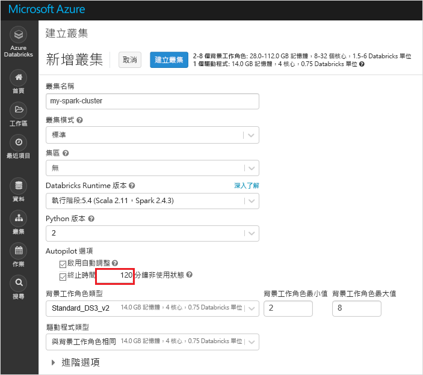

# <a name="quickstart-analyze-data-with-databricks"></a>快速入門：以 Databricks 分析資料

在本快速入門中，您將使用 Azure Databricks 執行 Apache Spark 作業，以對儲存體帳戶中儲存的資料執行分析。 在 Spark 作業中，您將分析電台頻道訂用帳戶資料，以根據人口統計資料深入了解免費/付費的使用情形。

## <a name="prerequisites"></a>Prerequisites

* 具有有效訂用帳戶的 Azure 帳戶。 [免費建立帳戶](https://azure.microsoft.com/free/?ref=microsoft.com&utm_source=microsoft.com&utm_medium=docs&utm_campaign=visualstudio)。

* 您的 Azure Data Lake Gen2 儲存體帳戶的名稱。 [建立 Azure Data Lake Storage Gen2 儲存體帳戶](data-lake-storage-quickstart-create-account.md)。

* 已被指派**儲存體 Blob 資料參與者**角色之 Azure 服務主體的租用戶識別碼、應用程式識別碼和密碼。 [建立服務主體](../../active-directory/develop/howto-create-service-principal-portal.md)。

  > [!IMPORTANT]
  > 在 Data Lake Storage Gen2 儲存體帳戶的範圍中指派該角色。 您可以將角色指派給父資源群組或訂用帳戶，但在這些角色指派傳播至儲存體帳戶之前，您將會收到與權限有關的錯誤。

## <a name="create-an-azure-databricks-workspace"></a>建立 Azure Databricks 工作區

在本節中，您會使用 Azure 入口網站建立 Azure Databricks 工作區。

1. 在 Azure 入口網站中，選取 [建立資源]   > [分析]   > [Azure Databricks]  。

    

2. 在 [Azure Databricks 服務]  底下，提供值以建立 Databricks 工作區。

    

    提供下列值：

    |屬性  |描述  |
    |---------|---------|
    |**工作區名稱**     | 提供您 Databricks 工作區的名稱        |
    |**訂用帳戶**     | 從下拉式清單中選取您的 Azure 訂用帳戶。        |
    |**資源群組**     | 指定您是要建立新的資源群組，還是使用現有資源群組。 資源群組是存放 Azure 方案相關資源的容器。 如需詳細資訊，請參閱 [Azure 資源群組概觀](../../azure-resource-manager/management/overview.md)。 |
    |**位置**     | 選取 [美國西部 2]  。 請自由選擇另一個公用區域，如果您想要的話。        |
    |定價層      |  選擇 [標準]  或 [進階]  。 如需這些定價層的詳細資訊，請參閱 [Databricks 定價頁面](https://azure.microsoft.com/pricing/details/databricks/)。       |

3. 建立帳戶需要幾分鐘的時間。 若要監視作業狀態，請檢視頂端的進度列。

4. 選取 [釘選到儀表板]  ，然後選取 [建立]  。

## <a name="create-a-spark-cluster-in-databricks"></a>在 Databricks 中建立 Spark 叢集

1. 在 Azure 入口網站中，移至您所建立的 Databricks 工作區，然後選取 [啟動工作區]  。

2. 系統會將您重新導向至 Azure Databricks 入口網站。 在入口網站中，選取 [新增]   > [叢集]  。

    

3. 在 [新增叢集]  頁面上，提供值以建立叢集。

    

    填寫下列欄位的值，然後接受其他欄位的預設值：

    - 輸入叢集的名稱。
     
    - 務必要選取 [在停止活動 120 分鐘後終止]  核取方塊。 請提供用來終止叢集的叢集未使用持續時間 (以分鐘為單位)。

4. 選取 [建立叢集]  。 叢集在執行後，您就可以將 Notebook 連結至叢集，並執行 Spark 作業。

如需如何建立叢集的詳細資訊，請參閱[在 Azure Databricks 建立 Spark 叢集](https://docs.azuredatabricks.net/user-guide/clusters/create.html)。

## <a name="create-storage-account-container"></a>建立儲存體帳戶容器

在本節中，您會在 Azure Databricks 工作區中建立 Notebook，然後執行程式碼片段以設定儲存體帳戶。

1. 在 [Azure 入口網站](https://portal.azure.com)中，移至您所建立的 Azure Databricks 工作區，然後選取 [啟動工作區]  。

2. 在左側窗格中，選取 [工作區]  。 從 [工作區]  下拉式清單選取 [建立]   > [Notebook]  。

    

3. 在 [建立 Notebook]  對話方塊中，輸入 Notebook 的名稱。 選取 [Scala]  作為語言，然後選取您先前建立的 Spark 叢集。

    

    選取 [建立]  。

4. 將下列程式碼區塊複製並貼到第一個資料格中，但先不要執行此程式碼。

   ```scala
   spark.conf.set("fs.azure.account.auth.type.<storage-account-name>.dfs.core.windows.net", "OAuth")
   spark.conf.set("fs.azure.account.oauth.provider.type.<storage-account-name>.dfs.core.windows.net", "org.apache.hadoop.fs.azurebfs.oauth2.ClientCredsTokenProvider")
   spark.conf.set("fs.azure.account.oauth2.client.id.<storage-account-name>.dfs.core.windows.net", "<appID>")
   spark.conf.set("fs.azure.account.oauth2.client.secret.<storage-account-name>.dfs.core.windows.net", "<password>")
   spark.conf.set("fs.azure.account.oauth2.client.endpoint.<storage-account-name>.dfs.core.windows.net", "https://login.microsoftonline.com/<tenant-id>/oauth2/token")
   spark.conf.set("fs.azure.createRemoteFileSystemDuringInitialization", "true")
   dbutils.fs.ls("abfss://<container-name>@<storage-account-name>.dfs.core.windows.net/")
   spark.conf.set("fs.azure.createRemoteFileSystemDuringInitialization", "false")

   ```

    > [!NOTE]
    > 此程式碼區塊會使用 OAuth 直接存取 Data Lake Gen2 端點，但也有其他方法可將 Databricks 工作區連線至您的 Data Lake Storage Gen2 帳戶。 例如，您可以使用 OAuth 來掛接容器，或透過共用金鑰使用直接存取。 <br>若要查看這些方法的範例，請參閱 Azure Databricks 網站上的 [Azure Data Lake Storage Gen2](https://docs.azuredatabricks.net/spark/latest/data-sources/azure/azure-datalake-gen2.html) 一文。

5. 在此程式碼區塊中，請將此程式碼區塊中的 `storage-account-name`、`appID`、`password` 和 `tenant-id` 預留位置值取代為您在建立服務主體時所收集到的值。 將 `container-name` 預留位置值設為您要為容器指定的任何名稱。

    > [!NOTE]
    > 在生產環境設定中，請考慮將驗證金鑰儲存在 Azure Databricks 中。 然後，將查閱索引鍵新增至程式碼區塊，而不是驗證金鑰。 完成此快速入門之後，請參閱 Azure Databricks 網站上的 [Azure Data Lake Storage Gen2](https://docs.azuredatabricks.net/spark/latest/data-sources/azure/azure-datalake-gen2.html) 一文，以檢視此方法的範例。

6. 按 **SHIFT + ENTER** 鍵以執行此區塊中的程式碼。

## <a name="ingest-sample-data"></a>內嵌範例資料

開始本節之前，您必須先完成下列必要條件：

在 Notebook 資料格中輸入下列程式碼：

    %sh wget -P /tmp https://raw.githubusercontent.com/Azure/usql/master/Examples/Samples/Data/json/radiowebsite/small_radio_json.json

在資料格中按 **SHIFT + ENTER** 執行程式碼。

現在，在此資料格下方的新資料格中輸入下列程式碼，並將括號中的值取代為您稍早使用的相同值：

    dbutils.fs.cp("file:///tmp/small_radio_json.json", "abfss://<container-name>@<storage-account-name>.dfs.core.windows.net/")

在資料格中按 **SHIFT + ENTER** 執行程式碼。

## <a name="run-a-spark-sql-job"></a>執行 Spark SQL 作業

執行下列工作以在資料上執行 Spark SQL 作業。

1. 執行 SQL 陳述式，以使用 JSON 資料檔案範例 **small_radio_json.json** 中的資料建立暫存資料表。 在下列程式碼片段中，將預留位置值取代為您的容器名稱和儲存體帳戶名稱。 使用您稍早建立的 Notebook，在 Notebook 的新程式碼資料格中貼上程式碼片段，然後按下 SHIFT + ENTER 鍵。

    ```sql
    %sql
    DROP TABLE IF EXISTS radio_sample_data;
    CREATE TABLE radio_sample_data
    USING json
    OPTIONS (
     path  "abfss://<container-name>@<storage-account-name>.dfs.core.windows.net/small_radio_json.json"
    )
    ```

    在命令順利完成後，您就會將 JSON 檔案中的所有資料變成 Databricks 叢集中的資料表。

    `%sql` 語言的 magic 命令可讓您從 Notebook 執行 SQL 程式碼，即使該 Notebook 屬於其他類型也是如此。 如需詳細資訊，請參閱[在 Notebook 中混合使用語言](https://docs.azuredatabricks.net/user-guide/notebooks/index.html#mixing-languages-in-a-notebook)。

2. 讓我們看看 JSON 資料範例的快照集，以便進一步了解您所執行的查詢。 將下列程式碼片段貼到程式碼資料格中，然後按下 **SHIFT + ENTER**。

    ```sql
    %sql
    SELECT * from radio_sample_data
    ```

3. 您會看到如下列螢幕擷取畫面所示的表格式輸出 (僅顯示某些資料行)：

    

    至於其他細節，資料範例會擷取電台頻道的聽眾性別 (資料行名稱為**性別**)，以及其擁有的是免費或付費訂閱 (資料行名稱為**層級**)。

4. 您現在可以建立這項資料的視覺呈現，以顯示每種性別、多少使用者擁有免費帳戶，以及多少使用者是付費訂閱者。 從表格式輸出底部，按一下 [長條圖]  圖示，然後再按一下 [繪圖選項]  。

    

5. 在 [自訂繪圖]  中，如螢幕擷取畫面所示的方式拖放值。

    

    - 將 [索引鍵]  設定為 [性別]  。
    - 將 [數列群組]  設定為 [層級]  。
    - 將 [值]  設定為 [層級]  。
    - 將 [彙總]  設定為 [計數]  。

6. 按一下 [套用]  。

7. 輸出會顯示這些值的視覺呈現，如下列螢幕擷取畫面所示：

     

## <a name="clean-up-resources"></a>清除資源

在完成本文後，您可以終止叢集。 從 Azure Databricks 工作區，選取 [叢集]  ，然後找到您要終止的叢集。 將游標游標移到 [動作]  資料行底下的省略符號上，然後選取 [終止]  圖示。


如果您不手動終止叢集，叢集會自動停止，但前提是您已在建立叢集時選取 [在停止活動\_\_分鐘後終止]  核取方塊。 如果您設定此選項，叢集會在停止活動達指定時間長度後停止。

## <a name="next-steps"></a>後續步驟

在本文中，您已在 Azure Databricks 建立 Spark 叢集，並使用已啟用 Data Lake Storage Gen2 的儲存體帳戶所儲存的資料執行 Spark 作業。 您也可以查看 [Spark 資料來源](https://docs.azuredatabricks.net/spark/latest/data-sources/index.html)，以了解如何從其他資料來源將資料匯入到 Azure Databricks。 前往下一篇文章，以了解如何使用 Azure Databricks 執行 ETL 作業 (擷取、轉換及載入資料)。

> [!div class="nextstepaction"]
>[使用 Azure Databrick 擷取、轉換和載入資料](../../azure-databricks/databricks-extract-load-sql-data-warehouse.md)
