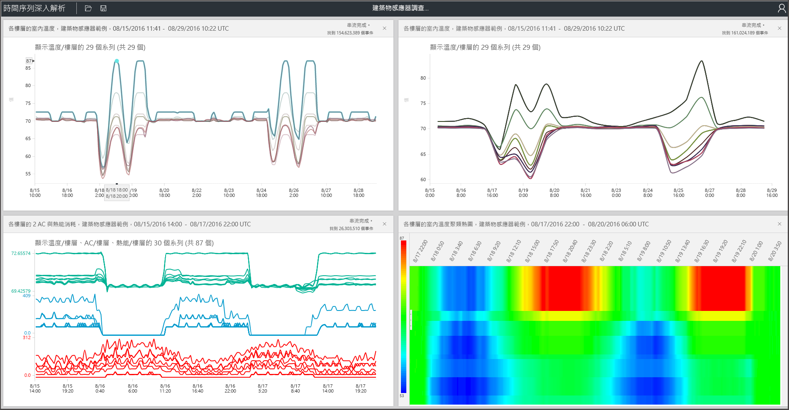

# 什麼是 Azure 時間序列深入解析？

建置 Azure 時間序列深入解析是為了儲存、視覺化及查詢大量時間序列資料，例如 IoT 裝置所產生的時間序列資料。 如果您想要儲存、管理、查詢或以視覺化方式呈現雲端的時間序列資料，時間序列深入解析可能很適合您。

時間序列深入解析有四個主要工作：

- 其能夠和 Azure IoT 中樞和 Azure 事件中樞這類雲端閘道完全整合。 其可輕鬆地連線到這些事件來源，若訊息和結構在無錯誤的資料列和資料行中有資料，即剖析 JSON。 它會聯結中繼資料與遙測資料，而且將單欄式存放區中的資料編製索引。
- 時間序列深入解析會管理資料的儲存體。 為了確保隨時能夠輕鬆存取資料，它會將資料儲存在記憶體和 SSD 中長達 400 天。 您可以視需求在幾秒內以互動方式查詢數十億個事件。
- 時間序列深入解析可透過 [時間序列深入解析總管] 提供立即可用的視覺效果。
- 時間序列深入解析可在 [時間序列深入解析總管] 中提供查詢服務，也可以用 API 查詢，API 方便整合，可將時間序列資料嵌入到自訂應用程式中。

如果您要建置應用程式，以供內部取用或供外部客戶使用，則可以使用時間序列深入解析來作為後端。 您可以將其用於編製索引、儲存和彙總時間序列資料。 若要打造頂級的自訂視覺效果和使用者體驗，請使用[用戶端 SDK](https://github.com/microsoft/tsiclient/blob/master/docs/API.md)。 時間序列深入解析也配有數個用來啟用這些自訂案例的[查詢 API](how-to-shape-query-json.md)。

時間序列資料代表資產或處理程序如何隨著時間改變。 時間序列資料會根據時間戳記編製索引，而且時間是最具意義的軸，這類資料會隨著時間軸進行組織。 時間序列資料通常會依照順序送達，因此會將其視為插入資料庫，而不是更新資料庫。

想要大量儲存、編製索引、查詢、分析和視覺化時間序列資料並不容易。
Azure 時間序列深入解析會擷取每個新事件並將其各自儲存為資料列，而且會有效率地不時測量變更。 因此，您可以回顧過去來建立深入解析以預測未來的變化。

## 影片

### 深入了解 Azure 時間序列深入解析 (雲端式 IoT 分析平台)。 

## 主要案例

- 以可擴充的方式儲存時間序列資料。

   基本上，時間序列深入解析具有以時間序列資料為設計考量的資料庫。 因為該資料庫可擴充且完全受控，所以時間序列深入解析可處理事件的儲存和管理工作。

- 近乎即時地探索資料。

   時間序列深入解析提供的總管可以視覺化方式呈現流入環境中的所有資料。 連線至事件來源後不久，您即可檢視、探索及查詢時間序列深入解析內的事件資料。 此資料可協助您驗證裝置是否如預期般發出資料，以及監視 IoT 資產的健康情況、生產力和整體效益。

- 執行根本原因分析並偵測異常狀況。

   時間序列深入解析具有模式和透視檢視等工具，可進行和儲存多步驟的根本原因分析。 時間序列深入解析也可以和 Azure 串流分析等警示服務一起運作，讓您可以在時間序列深入解析總管中以近乎即時的方式檢視警示和偵測到的異常情況。

- 從來自不同位置的時間序列資料獲得全域檢視，可供用來比較多個資料或網站。

   您可以將多個事件來源連線到時間序列深入解析環境。 如此一來，您就能以近乎即時的方式一起檢視從多個不同位置流入的資料。 使用者可以利用此可見性來與商務領導者共享資料。 其可與運用專業知識來協助解決問題、套用最佳做法及分享學習的各領域專家更密切地合作。

- 在時間序列深入解析上建置客戶應用程式。

   時間序列深入解析公開的 REST 查詢 API 可供您用來建置使用時間序列資料的應用程式。

## 功能

- **快速上手**：Azure 時間序列深入解析不需要事先準備資料，因此您可以快速地連線至 IoT 中樞或事件中樞內的數百萬個事件。 連線後，您即可與感應器資料互動並加以視覺化，進而快速驗證您的 IoT 解決方案。 您不需撰寫程式碼即可與您的資料互動，而且也不需要學習新語言。 時間序列深入解析會為進階使用者提供細微且可輸入任意文字的查詢介面，並提供點選探索功能。

- **近乎即時的深入解析**：時間序列深入解析每天可以擷取數百萬個感應器事件，其延遲時間只有一分鐘。 時間序列深入解析可協助您從感應器資料獲得深入解析。 其可讓您找出趨勢和異常狀況、進行根本原因分析，並避免代價高昂的停機時間。 將即時和歷史的資料相互關聯可協助您找出資料中隱藏的趨勢。

- **建置自訂解決方案**：請將 Azure 時間序列深入解析資料內嵌到現有應用程式中。 您也可以使用時間序列深入解析 REST API 來建立新的自訂解決方案。 建立可以分享的個人化檢視，以便其他人瀏覽您的深入解析。

- **延展性**：時間序列深入解析是為了大規模支援 IoT 而設計。 它每天可以輸入 1 百萬到 1 億個事件，預設的保留時間長度是 31 天。 您可以用近乎即時的方式，將即時資料流和歷史資料視覺化並加以分析。

## 開始使用

若要開始，請遵循下列步驟。

1. 在 Azure 入口網站中佈建時間序列深入解析環境。
1. 連線至 IoT 中樞或事件中樞等事件來源。
1. 上傳參考資料。 這不是一項額外服務。
1. 在幾分鐘內使用時間序列深入解析總管檢閱及顯示您的資料。

## 總管

使用 Azure 時間序列深入解析總管來檢視、分析及探索資料中的趨勢。

了解如何使用 [Azure 時間序列深入解析總管](time-series-insights-explorer.md)，並從您的資料中擷取深入解析。

## 後續步驟

- 探索 Azure 時間序列深入解析正式可用的[免費示範環境](./time-series-quickstart.md)。

- 深入了解如何[規劃時間序列深入解析](time-series-insights-environment-planning.md)環境。
