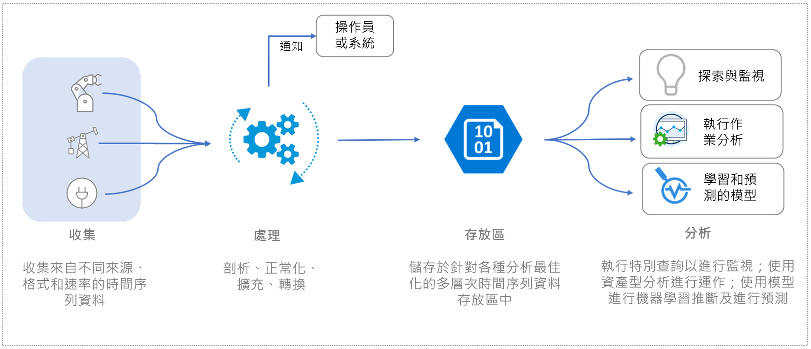
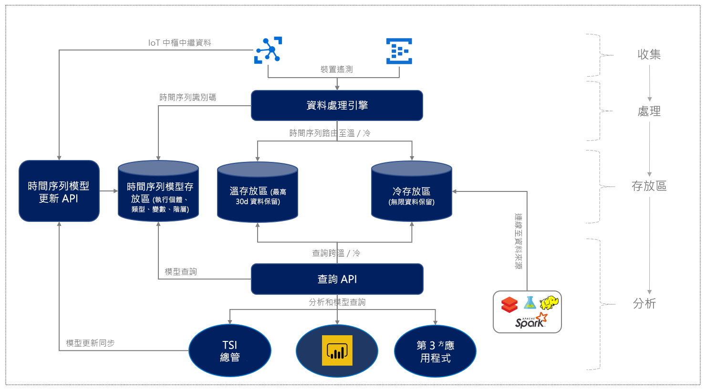

# 什麼是 Azure 時間序列深入解析預覽版？

Azure 時間序列深入解析預覽版為端對端的平台即服務 (PaaS) 供應項目。 您可以使用它來收集、處理、儲存、分析和查詢物聯網 (IoT) 規模的資料，也就是與內容高度相關且經過時間序列最佳化的資料。 

時間序列深入解析是針對特定資料探索及營運分析所設計。 它是可延伸且可自訂的服務供應項目，符合產業 IoT 部署的廣泛需求。

## 影片

深入了解「Azure 時間序列深入解析預覽」。

> [!VIDEO https://channel9.msdn.com/Shows/Internet-of-Things-Show/Azure-Time-Series-Insights-e2e-solution-for-industrial-IoT-analytics/player]

## IoT 資料的定義

資產密集組織中的產業 IoT 資料通常缺乏結構化的一致性，因為產業設定中的裝置和感應器本質不同。 這些資料流中的資料有差距大的特點，有時還有訊息損毀和讀數錯誤的特點。 IoT 資料通常在來自第一方或第三方來源 (如針對端對端工作流程新增內容的 CRM 或 ERP) 的其他資料輸入內容中才有意義。 來自第三方資料來源的輸入 (例如天氣資料) 可以協助您在指定的安裝中增加遙測資料流。 

這意味著，只有一小部分的資料會用於營運和商務用途，而分析則需要關聯化。 產業資料通常經過歷史化，以便在較長的時間範圍內進行深入分析，以了解趨勢並使其相互關聯。 將收集的 IoT 資料轉化為可付諸行動的見解需要： 

* 資料處理功能，用來清理、篩選、插入、轉換及準備資料，以進行分析。
* 組織結構功能，用來瀏覽和了解資料，亦即將資料標準化與情境化。
* 符合成本效益的儲存體，用來長期或無限期保留已處理 (或衍生) 的資料及未經處理的資料。

這類資料會提供一致、完整、最新且正確的資訊，以用於商務分析和報告。

下圖顯示典型的 IoT 資料流。

## 用於產業 IoT 的 Azure 時間序列深入解析

IoT 環境與橫跨各種產業區隔 (包括製造、汽車、能源、公用事業、智慧建築和諮詢) 的客戶不同。 在廣泛的產業 IoT 市場中，針對大規模 IoT 資料提供全方位分析的雲端原生解決方案仍在不斷發展。 

Azure 時間序列深入解析藉由提供一套全包式的端對端 IoT 分析解決方案，為情境化時間序列資料、以資產為基礎的深入解析，以及對於探索、趨勢、異常偵測和營運情報的最佳使用者體驗，提供豐富的語意模型，來解決這個市場需求。 

結合互動式資料探索功能的豐富營運分析平台，您可以使用時間序列深入解析，從 IoT 資產收集的資料衍生出更多價值。 預覽提供項目支援： 

* 支援線上和離線分析的多層式儲存解決方案，可讓客戶選擇在線上和離線資料之間路由傳送資料，以便透過線上資料以及營運情報，對數十個歷史資料進行互動式分析。 

    *   高度互動式線上分析解決方案，可針對較短的時間範圍資料執行頻繁且大量的查詢 
    *   可調整、高效能且成本經過最佳化的時間序列資料湖以 Azure 儲存體為基礎，可讓客戶在幾秒內完成多年時間序列資料的趨勢。 

* 語意模型支援，用於描述與衍生和原始訊號 (來自資產和裝置) 相關聯的網域和中繼資料。

* 彈性的分析平台，可在客戶擁有的 Azure 儲存體帳戶中儲存歷史時間序列資料，進而讓客戶擁有其 IoT 資料的所有權。 資料是以開放原始碼 Apache Parquet 格式儲存，可跨各種資料案例進行連線和交互操作，包括預測性分析、機器學習，以及使用熟悉的技術 (包括 Spark、Databricks 和 Jupyter) 所完成的其他自訂計算。

* 豐富的分析功能加上增強的查詢 API 和使用者經驗，可結合以資產為基礎的資料深入解析，以及豐富的即時資料分析功能，並支援插補、純量和彙總函式、類別變數、散佈圖和時間變動時間序列訊號，以進行深入分析。

*   企業級平台，可支援企業 IoT 客戶的規模、效能、安全性和可靠性需求。

* 端對端分析的擴充性和整合支援。 時間序列深入解析為各種資料案例提供可擴充的分析平台。 時間序列深入解析 Power BI 連接器可讓客戶將他們在時間序列深入解析中所進行的查詢直接帶入 Power BI 中，以便在單一窗口中獲得其 BI 和時間序列分析的統一觀點。

下圖顯示高階資料流程。

  

Azure 時間序列深入解析提供可調整的隨用隨付定價模型，以進行資料處理、儲存 (資料和中繼資料) 和查詢，讓客戶能夠調整其使用方式，以符合其商務需求。 
 
在引入這些主要的產業 IoT 功能之後，時間序列深入解析也提供下列主要優點。  

| | |
| ---| ---|
| 適用於 IoT 規模時間序列資料的多層式儲存體 | 透過共用資料處理管線來內嵌資料，您可以將資料內嵌至線上和離線存放區。 將線上存放區用於互動式查詢，並將離線存放區用於儲存大量資料。 若要深入了解如何利用以資產為基礎的高效能查詢，請參閱[查詢](./time-series-insights-update-tsq.md)。 |
| 用於情境化原始遙測資料和衍生資產型深入解析的時間序列模型 | 您可以使用時間序列模型建立時間序列資料的執行個體、階層、類型和變數。 若要深入了解時間序列模型，請參閱[時間序列模型](./time-series-insights-update-tsm.md)。  |
| 與其他資料解決方案順暢地持續整合 | 時間序列深入解析離線存放區中的資料[儲存](./time-series-insights-update-storage-ingress.md)在開放原始碼的 Apache Parquet 檔案中。 這可讓您在包含商業智慧、進階機器學習和預測性分析的案例中，與其他資料解決方案 (第 1 方或第 3 方) 進行資料整合。 |
| 近乎即時的資料探索 | 藉由 [Azure 時間序列深入解析預覽版總管](./time-series-insights-update-explorer.md)的使用者體驗，您可以為透過擷取管線串流的所有資料提供視覺效果。 連線事件來源後，您可以檢視、探索及查詢事件資料。 如此一來，您可以驗證裝置是否如預期般發出資料。 您也可以監視 IoT 資產的健康情況、生產力和整體效率。 | 
| 擴充性與整合 | Azure 時間序列深入解析 Power BI 連接器整合可透過 [匯出]  選項，直接在時間序列總管使用者體驗中使用，讓客戶可以將他們在使用者體驗中所建立的時間序列查詢，直接匯出至 Power BI 桌面，然後同時檢視其時間序列圖表與其他 BI 分析。 這會針對已投資 Power BI 的產業 IoT 企業，為新類別的案例開啟大門，方法是，從各種資料來源 (包括 IoT 時間序列) 提供分析的單一窗口。 | 
| 在時間序列深入解析平台上建置自訂應用程式 | 「時間序列深入解析」支援 [JavaScript SDK](https://github.com/microsoft/tsiclient/blob/master/docs/API.md)。 SDK 提供豐富的控制項和簡化的存取查詢。 使用 SDK 在時間序列深入解析上建置自訂 IoT 應用程式，以符合您的業務需求。 您也可以直接使用時間序列深入解析[查詢 API](./time-series-insights-update-tsq.md)，將資料導到自訂 IoT 應用程式中。 |

## 後續步驟

開始使用 Azure 時間序列深入解析預覽版：

> [!div class="nextstepaction"]
> [快速入門指南](./time-series-insights-update-quickstart.md)

了解使用案例：

> [!div class="nextstepaction"]
> [Azure 時間序列深入解析預覽版使用案例](./time-series-insights-update-use-cases.md)