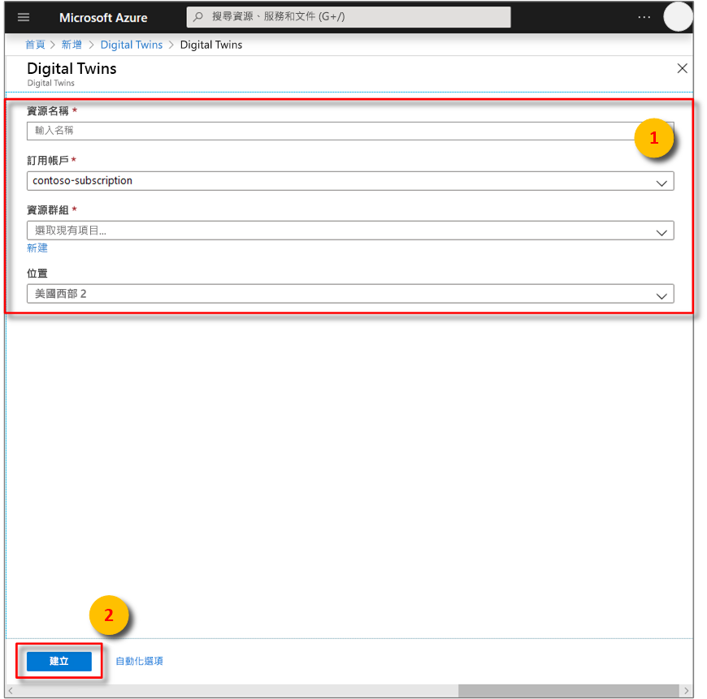
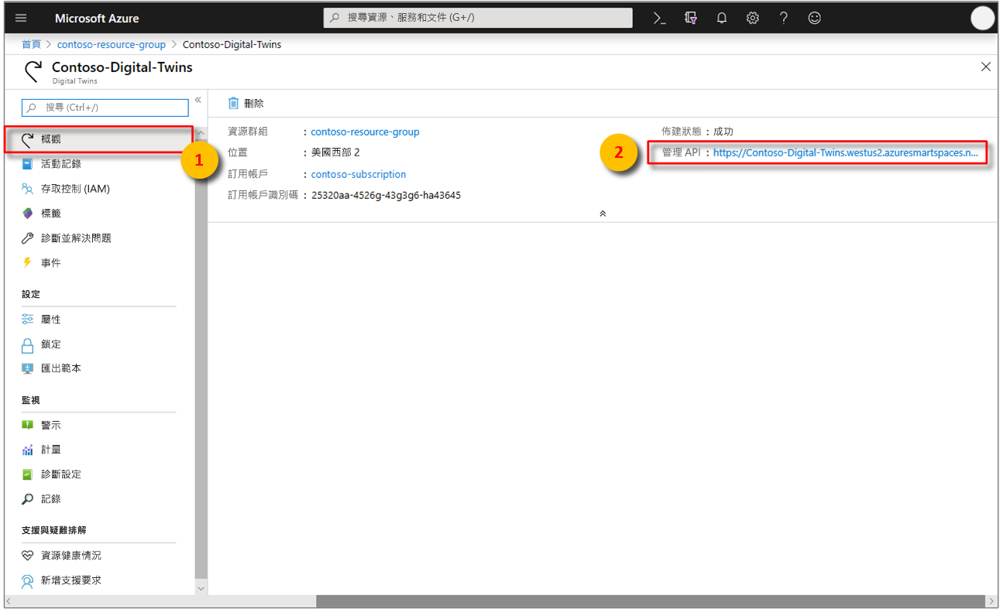

1. 登入 [Azure 入口網站](https://portal.azure.com)。

1. 從左窗格中選取 [建立資源]  。 搜尋「Digital Twins」  ，然後選取 [Digital Twins]  。 選取 [建立]  以啟動部署程序。

   

1. 在 [Digital Twins]  窗格中，輸入下列資訊：
   * **資源名稱**：為 Digital Twins 執行個體建立獨一無二的名稱。
   * 訂用帳戶  ：選擇您要用來建立此 Digital Twins 執行個體的訂用帳戶。 
   * **資源群組**：選取或建立 Digital Twins 執行個體的[資源群組](https://docs.microsoft.com/azure/azure-resource-manager/resource-group-overview#resource-groups)。
   * **位置**：選取最接近裝置的位置。

     

1. 檢閱 Digital Twins 資訊，然後選取 [建立]  。 Digital Twins 執行個體可能需要幾分鐘的時間才會建立好。 您可以在 [通知]  窗格中監視進度。

1. 開啟 Digital Twins 執行個體的 [概觀]  窗格。 請記下 [管理 API]  底下的連結。

   **管理 API** URL 的格式為：`https://yourDigitalTwinsName.yourLocation.azuresmartspaces.net/management/swagger`。 此 URL 會帶您前往您的執行個體所適用的 Azure Digital Twins REST API 文件。 請閱讀[如何使用 Azure Digital Twins Swagger](../articles/digital-twins/how-to-use-swagger.md)，以了解如何閱讀及使用此 API 文件。

    將**管理 API** URL 修改為此格式：`https://yourDigitalTwinsName.yourLocation.azuresmartspaces.net/management/api/v1.0/`。 應用程式會使用修改後的 URL 作為基底 URL 來存取執行個體。 將這個修改後的 URL 複製到暫存檔。 您在下一節中將會用到此 URL。

    