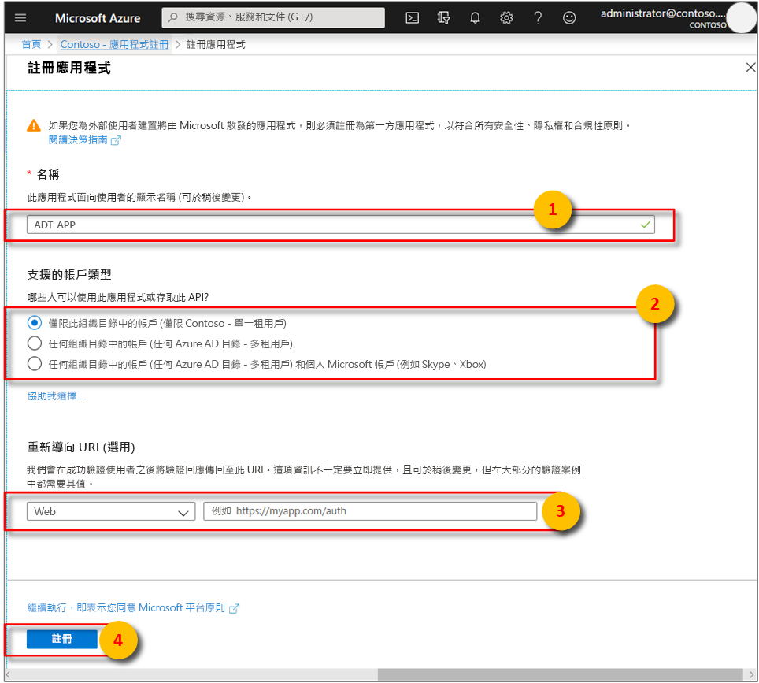

>[!NOTE]
>本節提供 [Azure AD 應用程式註冊](https://docs.microsoft.com/azure/active-directory/develop/quickstart-register-app)的指示。

1. 在 [Azure 入口網站](https://portal.azure.com)中，從可展開的左側功能表開啟 **Azure Active Directory**，然後開啟 [應用程式註冊]  窗格。 

    

1. 選取 [+ 新增註冊]  按鈕。

    [![選取 [新增註冊] 按鈕](./media/digital-twins-permissions/aad-app-register.png)](./media/digital-twins-permissions/aad-app-register.png#lightbox)

1. 在 [名稱]  方塊中為此應用程式註冊提供易記的名稱。 在 [重新導向 URI \(選擇性\)]  區段下方，選擇左側下拉式清單中的 [公用用戶端/原生 \(行動和桌面\)]  ，然後在右側的文字方塊中輸入 `https://microsoft.com`。 選取 [註冊]  。

    

1. 若要確定[應用程式註冊為**公用應用程式**](https://docs.microsoft.com/azure/active-directory/develop/scenario-desktop-app-registration)，請開啟應用程式註冊的 [驗證]  窗格，並在該窗格中向下捲動。 在 [預設用戶端類型]  區段中，針對 [將應用程式視為公用用戶端]  選擇 [是]  ，然後點擊 [儲存]  。

    檢查**存取權杖**，以在您的 Manifest.json 中啟用 **oauth2AllowImplicitFlow** 設定。

    

1.  開啟已註冊應用程式的 [概觀]  窗格，並將下列實體的值複製到暫存檔。 您會使用這些值來設定後續章節的應用程式範例。

    - **應用程式 (用戶端) 識別碼**
    - **目錄 (租用戶) 識別碼**

    

1. 開啟應用程式註冊的 [API 權限]  窗格。 選取 [+ 新增權限]  按鈕。 在 [要求 API 權限]  窗格中選取 [我的組織使用的 API]  索引標籤，然後搜尋下列其中一個項目：
    
    1. 第 1 課：建立 Windows Azure 儲存體物件`Azure Digital Twins`。 選取 **Azure Digital Twins** API。

        

    1. 或者，搜尋 `Azure Smart Spaces Service`。 選取 [Azure 智慧空間服務]  API。

        

    > [!IMPORTANT]
    > 所顯示的 Azure AD API 名稱和識別碼取決於您的租用戶：
    > * 測試租用戶和客戶帳戶應搜尋 `Azure Digital Twins`。
    > * 其他 Microsoft 帳戶應搜尋 `Azure Smart Spaces Service`。

1. 任一 API 經選取後，將會在相同的 [要求 API 權限]  窗格中顯示為 **Azure Digital Twins**。 選取 [讀取 ]  下拉式選項，然後選取 [Read.Write]  核取方塊。 選取 [新增權限]  按鈕。

    

1. 根據您組織的設定，您可能需要執行其他步驟，授與對此 API 的系統管理員存取權。 請連絡系統管理員以取得詳細資訊。 管理員存取權一經核准，[API 權限]  窗格中的 [需要管理員同意]  資料行就會顯示您的權限。 

    

    確認顯示 **Azure Digital Twins**。
