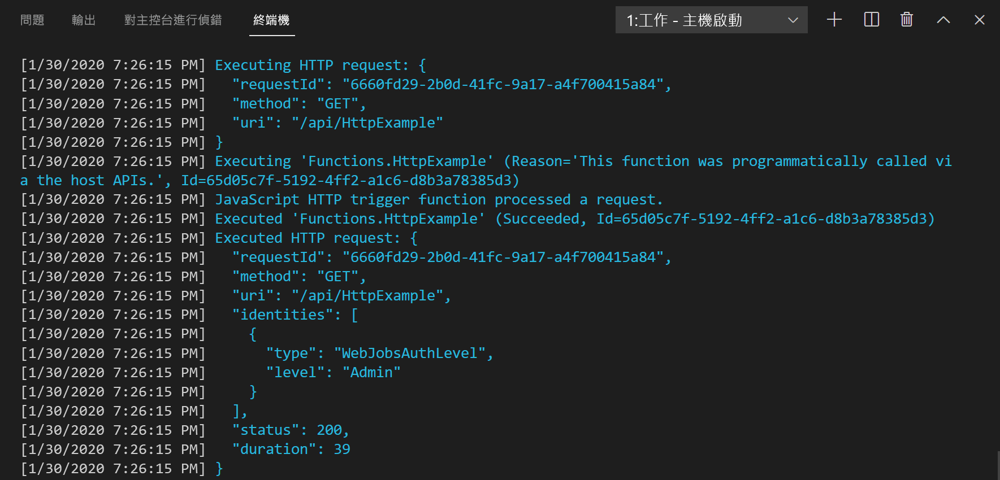

## <a name="run-the-function-locally"></a>在本機執行函式

Azure Functions Core Tools 與 Visual Studio Code 整合，可讓您在本機執行和偵錯 Azure Functions 專案。 如需如何在 Visual Studio Code 中進行偵錯的詳細資訊，請參閱[在本機進行 PowerShell Azure Functions 偵錯](../articles/azure-functions/functions-debug-powershell-local.md)。 

1. 按 F5 鍵以啟動函式應用程式專案。 Core Tools 的輸出會顯示在**終端機**面板中。

1. 在**終端機**面板中，複製 HTTP 觸發函式的 URL 端點。

    

1. 將查詢字串 `?name=<yourname>` 附加至此 URL，然後在次要 PowerShell 命令提示字元中使用 `Invoke-RestMethod` 執行要求，如下所示：

    ```powershell
    PS > Invoke-RestMethod -Method Get -Uri http://localhost:7071/api/HttpTrigger?name=PowerShell
    Hello PowerShell
    ```

    您也可以在瀏覽器中透過下列 URL 執行 GET 要求：

    <http://localhost:7071/api/HttpExample?name=PowerShell>

    如果您呼叫 HttpTrigger 端點，但未在本文中傳遞 `name` 參數作為查詢參數，則函式會傳回 `BadRequest` 錯誤。 當您檢閱 run.ps1 中的程式碼時，您會看到這個錯誤按設計發生。

1. 要求的相關資訊會顯示在 [終端機]  面板中。

    

1. 完成時，請按 **Ctrl + C** 來停止 Core Tools。

確認函式在本機電腦上正確執行之後，就可以將專案發佈到 Azure。